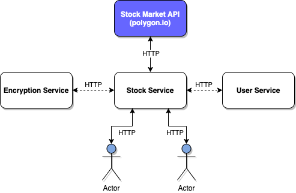

# Encrypted Stock Monitoring App

This is a daily stock monitoring app with encrypted response

## Overview

## Usecases

### Stock Service

As the main service, this service will be responsible for:

- Receive external `GET` request with `stock symbol`

- Fetch stock data from stock data market API (using https://www.polygon.io in this case) to get the following data points: current value, variation, previous close,
  open, bid, ask, market cap, volume, avg volume (you can display this raw / plain data in
  the logs).
  
- Encrypt the stock data with AES-256 as a response

### Encryption Service

This service will be responsible for:

- Receive `POST` API calls from stock service to be able to encrypt the stock data that will be inc and encrypt with AES-256 

### Auth Service (Bonus Point)

This service will be responsible for:

- Receive `GET` API calls to generate JWT token so that will be able to make API calls to stock service

- Receive `POST` API calls to validate JWT token that used to access the stock service

## Limitation

- Currently, the stock market data API that used in this app is limited to get the stock result per yesterday and there are limitation on API calls per minutes (for free version)
